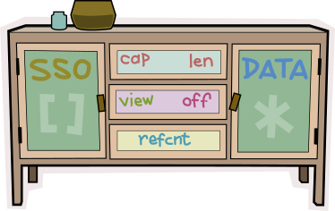
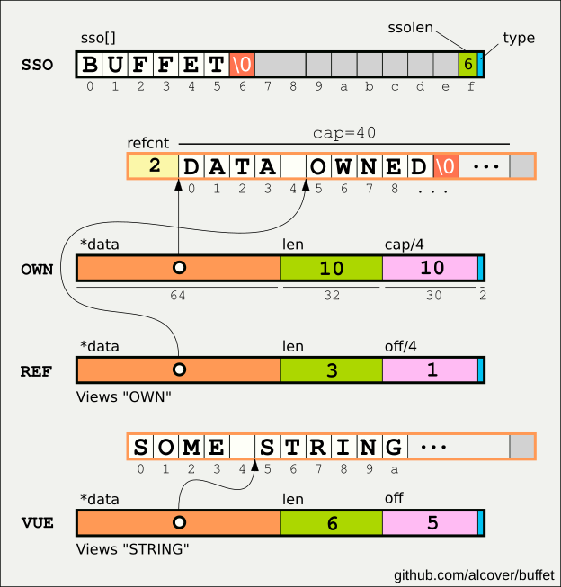

  

# Buffet
All-inclusive Buffer for C  
(Unit-tested but not yet stable, optimized or feature-complete)  


:orange_book: [API](#API)

*Buffet* is a versatile string buffer type featuring
- automated storage and reallocation  
- **SSO** (Small String Optimization) : short data is stored inline
- **views** : no-cost references to slices of data  
- **ref count** : accounting of reference-owner relation

In only **16 bytes**, fitting a 128-bit register.


## How
Through a tagged union:  

```C
typedef union Buffet {
      
    // SSO
    struct {
        char        sso[15]  // in-situ data
        uint8_t     ssolen:4 // in-situ length
    }

    // OWN | REF | VUE
    struct { 
        uint32_t len // data length
        union {
              uint32_t off // REF: data offset; VUE: address remainder
              struct {
                    uint16_t refcnt // OWN: number of references
                    uint8_t  cap    // OWN: log2(allocated mem)
              }
        }
        intptr_t data : 62 // OWN|VUE: data ptr; REF: ptr to owner
        uint8_t  type : 2  // tag = {SSO|OWN|REF|VUE}
    }
}
```  
Depending on its tag, a *Buffet* is interpreted as either
- `SSO` : a char array as value
- `OWN` : owning heap-allocated data
- `REF` : referencing a slice of a data-owning *Buffet*
- `VUE` : viewing data directly

Any *owned* data (SSO/OWN) is NUL-terminated.  




## Usage

### Build & unit-test

`make && make check`

### example

```C
#include <stdio.h>
#include "buffet.h"

int main()
{
    char text[] = "The train is fast";

    Buffet vue;
    bft_strview (&vue, text+4, 5);
    bft_print(&vue);

    text[4] = 'b';
    bft_print(&vue);

    Buffet ref = bft_view (&vue, 1, 4);
    bft_print(&ref);

    char wet[] = " is wet";
    bft_append (&ref, wet, sizeof(wet));
    bft_print(&ref);

    return 0;
}
```

```
$ gcc example.c buffet -o example && ./example
train
brain
rain
rain is wet
```


# API

[bft_new](#bft_new)  
[bft_strcopy](#bft_strcopy)  
[bft_strview](#bft_strview)  
[bft_copy](#bft_copy)  
[bft_view](#bft_view)  
[bft_free](#bft_free)  

[bft_append](#bft_append)  

[bft_cap](#bft_cap)  
[bft_len](#bft_len)  
[bft_data](#bft_data)  

[bft_cstr](#bft_cstr)  
[bft_export](#bft_export)  

[bft_print](#bft_print)  
[bft_dbg](#bft_dbg)  


### bft_new
```C
void bft_new (Buffet *dst, size_t cap)
```
Create a *Buffet* of capacity at least `cap`.  

```C
Buffet buf;
bft_new(&buf, 20);
bft_dbg(&buf); 
// type:OWN cap:32 len:0 data:''
```

### bft_strcopy
```C
void bft_strcopy (Buffet *dst, const char *src, size_t len)
```
Copy `len` bytes from `src` into new `dst`.  

```C
Buffet copy;
bft_strcopy(&copy, "Bonjour", 3);
bft_dbg(&copy); 
// type:SSO cap:14 len:3 data:'Bon'

```

### bft_strview
```C
void bft_strview (Buffet *dst, const char *src, size_t len)
```
View `len` bytes from `src` into new `dst`.  
You get a window into `src`. No copy or allocation is done.

```C
char src[] = "Eat Buffet!";
Buffet view;
bft_strview(&view, src+4, 3);
bft_dbg(&view);
// type:VUE cap:0 len:6 data:'Buffet!'
bft_print(&view);
// Buf
```

### bft_copy
```C
Buffet bft_copy (const Buffet *src, ptrdiff_t off, size_t len)
```
Create new *Buffet* by copying `len` bytes from [data(`src`) + `off`].  
The return is an independant owning Buffet.


### bft_view
```C
Buffet bft_view (Buffet *src, ptrdiff_t off, size_t len)
```
Create new *Buffet* by viewing `len` bytes from [data(`src`) + `off`].  
The return is internally either 
- a reference to `src` if `src` is owning
- a reference to `src`'s origin if `src` is itself a REF
- a view on `src` data if `src` is SSO or VUE

`src` now cannot be released before either  
- the return is released
- the return is detached as owner (e.g. when you `append()` to it).

```C
Buffet src;
bft_strcopy(&src, "Bonjour", 7);
Buffet ref = bft_view(&src, 0, 3);
bft_dbg(&ref);   // type:VUE cap:0 len:6 data:'Buffet!'
bft_print(&ref); // Bon
```


### bft_free
If *buf* is owning data and there are no references to it (*refcnt*==0),  
the data is released.  
In any case, *buf* is zeroed-out, making it an empty SSO.  
```C
void bft_free (Buffet *buf)
```

```C
Buffet buf;
bft_strcopy(&buf, "Too long for SSO..........", 16);
bft_dbg(&buf);
// type:OWN cap:32 len:16 data:'Too long for SSO'
bft_free(&buf);
bft_dbg(&buf);
// type:SSO cap:14 len:0 data:''
```


### bft_append
```C
size_t bft_append (Buffet *dst, const char *src, size_t len)
```
Appends `len` bytes from `src` to `dst`.  
Returns new length or 0 on error.

If over capacity, `dst` gets reallocated. 

```C
Buffet buf;
bft_strcopy(&buf, "abc", 3); 
size_t newlen = bft_append(&buf, "def", 3); // newlen == 6 
bft_dbg(&buf);
// type:SSO cap:14 len:6 data:'abcdef'
```


### bft_cap  
Get current capacity.  
```C
size_t bft_cap (Buffet *buf)
```

### bft_len  
Get current length.  
```C
size_t bft_len (Buffet *buf)`
```

### bft_data
Get current data pointer.  
```C
const char* bft_data (const Buffet *buf)`
```
If *buf* is a ref/view, `strlen(bft_data)` may be longer than `buf.len`. 

### bft_cstr
Get current data as a NUL-terminated **C string**.  
```C
const char* bft_cstr (const Buffet *buf, bool *mustfree)
```
If REF/VUE, the slice is copied into a fresh C string that must be freed.

### bft_export
 Copies data up to `buf.len` into a fresh C string that must be freed.
```C
char* bft_export (const Buffet *buf)
```


### bft_print
Prints data up to `buf.len`.
```C
void bft_print (const Buffet *buf)`
```

### bft_dbg  
Prints *buf* state.  
```C
void bft_dbg (Buffet *buf)
```

```C
Buffet buf;
bft_strcopy(&buf, "foo", 3);
bft_dbg(&buf);
// type:SSO cap:14 len:3 data:'foo'
```